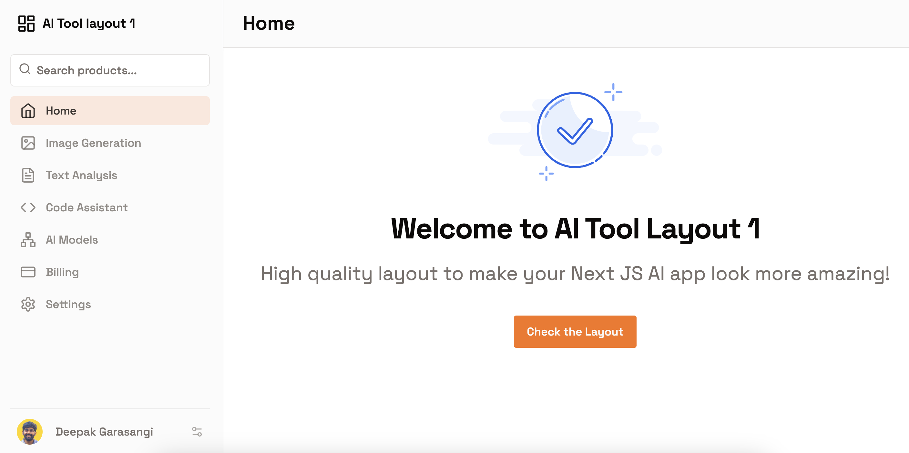
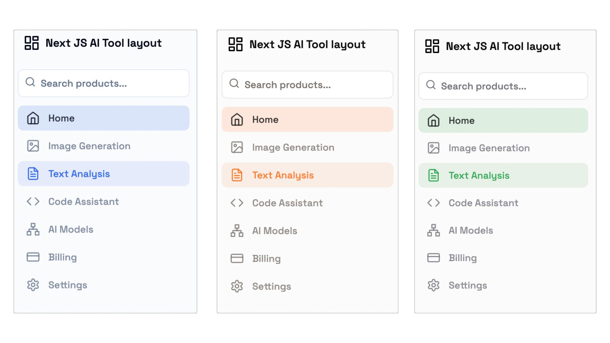
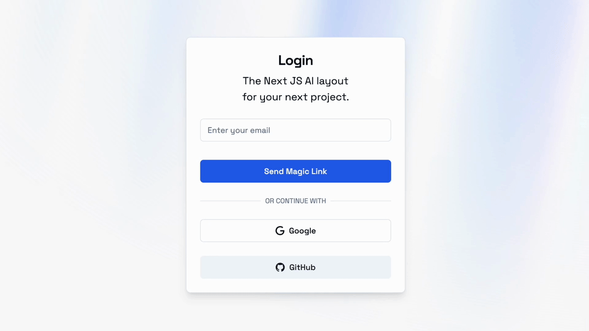

# Next JS AI template


Main Dashboard



Billing page


Use different themes from Shadcn - UI



Login page




## Features

1. Next JS layout for AI tools
1. Sample **Image generator AI tool scaffold**
1. Skeleton page for Billing and Support
1. Uses Shadcn UI, with [changeable themes](https://ui.shadcn.com/themes)
1. Has Google and Github login OAuth

## Quick start usage

```
cp sample.env.local .env.local
pnpm i
pnpm run dev
```

For more extensive installation guide check [Next JS 14 starter template](https://github.com/soulbliss/next-js-14-starter-template)

## Motivation

1. Building scaffolding for dashboard is essential for AI tools but boring.
2. I wanted a **high quality plug and play, modular next js layout**
3. Reusable layout which I can swap to use in any AI app

Note: **I am available for building AI MVP's** with Next JS, shadcn, tailwind, Open AI, Claude - 3.

**Reach out to me on [X](https://x.com/soulblissX) or [LinkedIn](https://www.linkedin.com/in/deepak-garasangi)**

## Update Sidebar

1. Edit `config/sidebar.ts` to change the values for sidebar navigational items.
2. Edit `config/siteConfig.ts` to update the website title

## Tech stack

- Next.js 14 App Directory
- Written in Typescript
- High quality SaaS dashboard Next JS layout
- AI Image Generator tool sample
- NextAuth 4
- Tailwind CSS
- Magic link login with Resend
- Google fonts
- Icons from [Lucide](https://lucide.dev)
- Dark mode with `next-themes`
- Tailwind CSS class sorting, merging and linting.

## Feedback

You can raise an issue or **reach out to me on [X](https://x.com/soulblissX) or [LinkedIn](https://www.linkedin.com/in/deepak-garasangi)** for sharing feedback.

Happy to add features which you require!

## Todo

1. Add annual plan for pricing - [Prasanna](https://x.com/worldofprasanna/status/1804690511225340311)
2. Menu items, paragraphs need to bit more clean/readable, like an IBM Sans, Open Sans - [Mattia](https://x.com/heymattia/status/1804845580453036238)
3. Three AI tools layout
   1. Add responsive support
4. Add dark mode compatibility

## License

Licensed under the [MIT license](https://github.com/shadcn/ui/blob/main/LICENSE.md).
